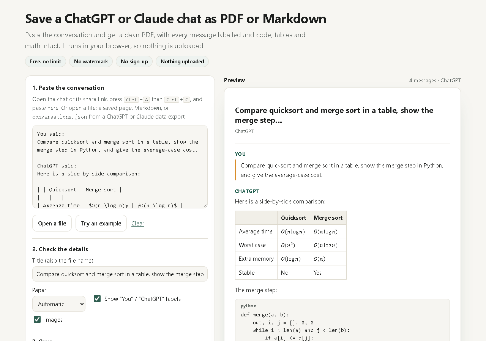
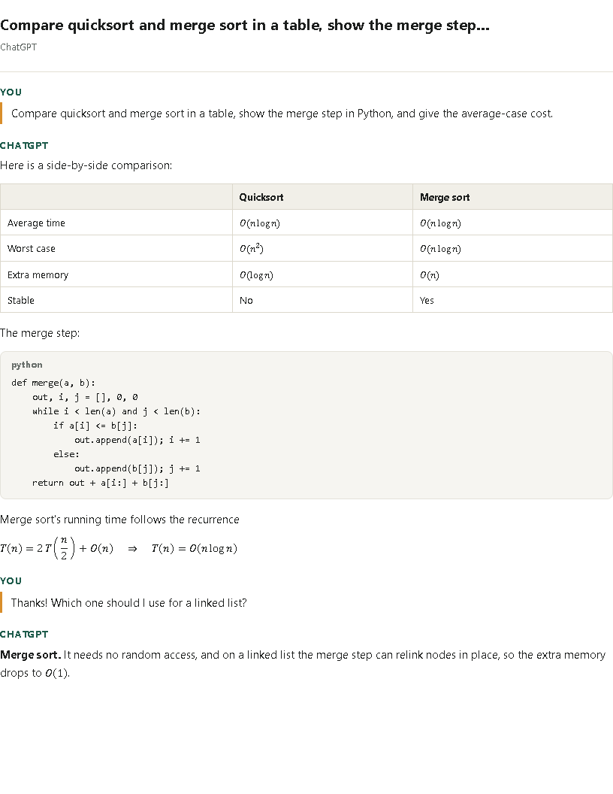

# Chat to PDF

Save a **ChatGPT** or **Claude** conversation as a clean **PDF** or **Markdown** file, in your browser.

Paste the conversation (or open `conversations.json` from the official data export), check the preview, and press **Save as PDF**. Every message is labelled, and code blocks, tables and math come through intact. Nothing is uploaded.



## What it does

- **Paste from the chat page.** Open the chat (or its share link), press <kbd>Ctrl</kbd>+<kbd>A</kbd>, <kbd>Ctrl</kbd>+<kbd>C</kbd>, and paste. The tool finds each message, labels who said it, and drops the sidebar, buttons and message box.
- **Or paste plain text / Markdown.** It splits turns on markers like `You said:` / `ChatGPT said:`, `## You` / `## Claude`, or `User:` / `Assistant:`.
- **Or open an official export.** ChatGPT's and Claude's "Export data" give you a ZIP with `conversations.json` (ChatGPT also includes `chat.html`). Open it here, filter by title, pick a conversation. For ChatGPT, only the branch you were looking at is kept, not the edits you abandoned.
- **PDF through the browser's own print engine**, so text stays selectable and searchable, and Chinese, Japanese, Arabic and other scripts print with your system fonts.
- **Code blocks** keep indentation and the language name, and long lines wrap in the PDF instead of being cut off.
- **Tables** keep their columns; the header row repeats on every printed page.
- **Math** (`$…$`, `$$…$$`, `\(…\)`, `\[…\]`) is rendered as real formulas with [Temml](https://temml.org/) (MathML). Dollar amounts like "$5 and $10" are left alone. The Markdown download keeps the original TeX.
- **Markdown download** with `## You` / `## ChatGPT` sections.

Here's the print preview of the built-in example:



## Why I built it

ChatGPT has no "save this chat as PDF" button. Its [Export data](https://help.openai.com/en/articles/7260999-how-do-i-export-my-chatgpt-history-and-data) option emails you a ZIP of your whole history as data files, which can take a while to arrive. [Claude's export](https://support.anthropic.com/en/articles/9450526-how-can-i-export-my-claude-ai-data) is similar. Printing the chat page directly gives you the sidebar, cut-off code and broken math.

The web tools that take a share link do it by fetching the conversation on their server. Both OpenAI's and Anthropic's terms forbid automated extraction from their services, and it means handing your conversation to a third party. So this one only works with what you paste or open yourself, and the page is locked down so it can't send anything anywhere.

## How to use it

**Online:** <https://pressleaf.roledawn.com/tools/chat-to-pdf>

**Locally:** download or clone this repo and open `index.html`. The bundled script in `dist/` is committed, so there's nothing to build or install.

```bash
git clone https://github.com/binbuilds0/chat-to-pdf.git
cd chat-to-pdf
# open index.html in Chrome, Edge, Firefox or Safari
```

1. **Paste** the conversation, or click **Open a file**. Click **Try an example** to see what the output looks like.
2. **Check the details:** title (also used as the file name), paper size, labels, images.
3. **Save:** press **Save as PDF** and choose "Save as PDF" as the destination in the print window. Or click **Download Markdown**.

Pasting a bare share link shows a short how-to instead of fetching it.

### Privacy

The page's Content-Security-Policy sets `connect-src 'none'`, so the browser blocks every network request from the tool, and scripts can only load from the page's own folder. Pasted HTML is passed through an allowlist sanitizer before it's displayed (no scripts, event handlers, iframes or `javascript:` links). Images in a pasted conversation are shown from their original URLs; untick **Images** if you'd rather not load them.

## Limitations

- **It doesn't open share links for you.** Open the link in your browser and copy the page instead.
- **Fully supported: ChatGPT and Claude** (pasted pages, text and official exports). Gemini pages pasted from the browser are recognised too. Other chat sites usually work as plain text if the turns are labelled (`User:` / `Assistant:`), but without guarantees.
- **Images in exports** show as `[image]`, because `conversations.json` only references uploaded files.
- **Canvas / Artifacts / tool calls** that aren't part of the visible message text aren't included.
- **The PDF comes from your browser's print dialog,** so you click once more to save it. On phones, the system share or print sheet opens instead.

## Development

```
index.html           the page (markup, screen and print styles)
src/parse.js         no-DOM, no-dependency logic: turn splitting, math detection, export parsing, Markdown
src/render.js        HTML sanitizer, chat page structure, Markdown ⇄ HTML (marked, turndown)
src/app.js           page logic; bundled with Temml into dist/chat-to-pdf.js
scripts/build.mjs    esbuild bundle (a classic script, so index.html works from file://)
test/                node:test unit tests
```

```bash
npm install
npm test          # node --test (test/parse.test.js needs no dependencies at all)
npm run build     # rebuilds dist/chat-to-pdf.js after you change src/
```

Requires Node 20 or newer. Pull requests are welcome, especially pasted HTML samples from chat pages that don't split correctly (remove anything private first).

## Want to skip the copy and paste?

[Pressleaf](https://pressleaf.roledawn.com), built by the same author, is a Chrome extension that saves the open ChatGPT, Claude or Gemini conversation, or any web page without the ads and pop-ups, as a clean PDF in one click.

## License

[MIT](LICENSE) © binbuilds. Bundled libraries keep their own licenses: [marked](https://github.com/markedjs/marked) (MIT), [Turndown](https://github.com/mixmark-io/turndown) and turndown-plugin-gfm (MIT), [Temml](https://github.com/ronkok/Temml) (MIT).

ChatGPT is a trademark of OpenAI. Claude is a trademark of Anthropic. This project is not affiliated with either.
